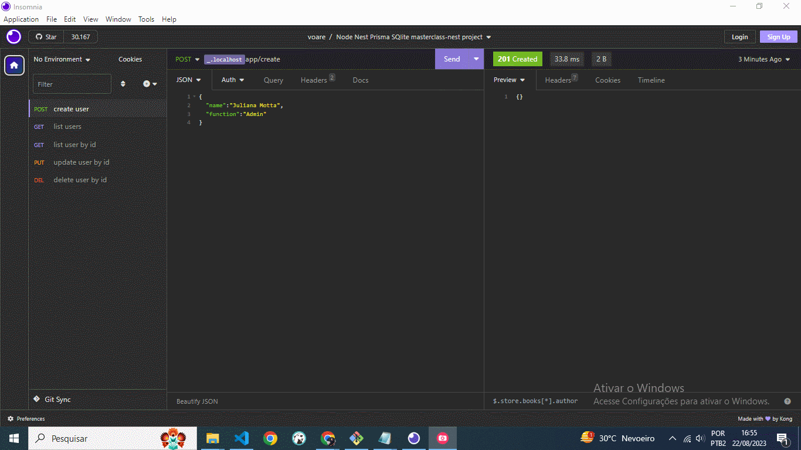

# 💪 NestJS - Prisma - SQlite

Projeto de criação de um CRUD com NestJS, ORM Prisma e Banco de dados SQlite.

## Pré-requisitos

Visual Studio Code

Para teste local utilize Insomnia ou Postman

## Uso
Clone o Projeto no GitHub:
https://github.com/1andersonmotta/siteSS.git 
Abra o projeto com Visual Studio Code e execute no terminal o comando:  
$ yarn install  
  
depois execute o comando para subir a aplicação  
$ yarn start:dev

## End Points

1. Primeiro Crie um Usuário com método POST:  `http://localhost:3000/app/create`  
com Body em JSON: {"name":"nome do usuário","function":"sua função aqui"}.  
2. Visualize todos os Perfis com método GET:  `http://localhost:3000/app`
3. Consulte um usuário específico pelo id no parâmetro com o método GET: `http://localhost:3000/app/:id`  
4. Atualize as Informações pelo id com novo body com método PUT: `http://localhost:3000/app/update/:id`  
com Body em JSON: {"name":"novo nome do usuário","function":"nova função aqui"}. 
5. Delete seus usuários pelo id com método DELETE: `http://localhost:3000/app/delete/:id`

[Insomnia](https://insomnia.rest/download)

## 🛠 Ferramentas

- [NestJS](https://docs.nestjs.com/)
- [Prisma](https://docs.nestjs.com/recipes/prisma)

## Contribuição

Se você tem alguma Sugestão enviar para devandersonmotta@gmail.com com o assunto: "NestJS-Prisma-SQlite" ou entre em contato pelo Linkedin.

## Licença

MIT

## ✉ Contato

email: devandersonmotta@gmail.com

linkedin: www.linkedin.com/in/anderson-motta-96b138235
---

## 💡 Objetivo

Praticar e adquirir conhecimento. 

